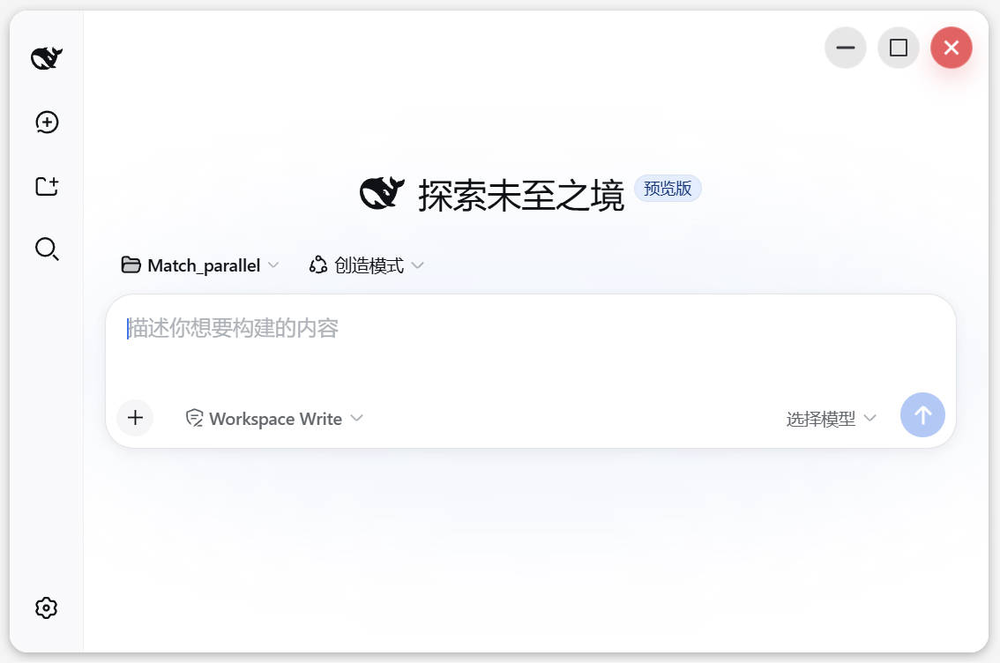

# dsh-desktop

English | [中文](README.zh.md)

Windows desktop shell for DeepSeek Harness and [LunaUI](https://github.com/VincentZe/LunaUI).



## Highlights

- Borderless rounded native window.
- No environment setup is required, but plugins cannot be installed.
- Conversation management improvements including multi-select, batch operations, recycle-bin retention, and model thinking-mode configuration.
- `dsh-subagent` can be called from Codex.

## dsh subagent

Install the portable package directly; it includes `dsh-subagent\SKILL.md`. It supports one-shot and persistent JSON-RPC runners, workspace grouping, lifecycle status, tool-error summaries, and caller-controlled interactions.

More details: [desktop README](desktop/README.md) and [subagent cookbook](docs/cookbook/running-subagent.md).

## Run

### Run from source

```powershell
pnpm install
pnpm run build
pnpm dsh web
```

### Build portable desktop

```powershell
cd desktop
.\build.ps1 -LunaUiDir <path-to-LunaUI> -WebView2Root <path-to-webview2-sdk>
```

The portable output is `desktop\build\portable`.
